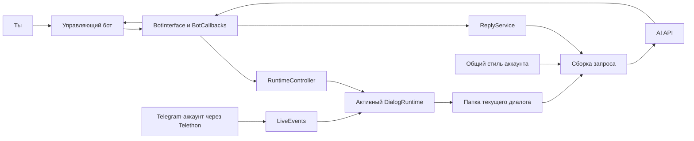

# MyBot: учебный путеводитель по собственному проекту

Снимок кода на 23 сентября 2026 года. Материал рассчитан на владельца проекта,
который начинает разбираться в Python и хочет самостоятельно читать уже написанный код.

Это объяснение существующей реализации, а не обещание, что все будущие функции
уже готовы. В этой учебной задаче исходный код приложения не изменяется.

## С чего начать

У тебя есть работающий по замыслу проект с двумя подключениями к Telegram,
локальными файлами и несколькими видами AI-запросов. Твоя первая задача —
научиться объяснять путь одного события. Запоминать все строки не требуется.

Материалы лучше открывать в таком порядке:

| Материал | Что получишь |
|---|---|
| Этот файл | Общую картину и историю изменений |
| [Интерактивная карта](project_map.html) | Маршруты событий, карточки модулей и печать стикеров; открыть в браузере |
| [Порядок выполнения](execution_walkthrough_ru.md) | Подробный проход от запуска до ответа, подготовки и остановки |
| [Атлас файлов](code_atlas_ru.md) | Где искать каждую ответственность и какие файлы были изменены |
| [Практический маршрут](learning_roadmap_ru.md) | Занятия, упражнения, контрольные вопросы и журнал непонятных мест |
| [Обычная работа через Telegram](telegram_workflow.md) | Пользовательская инструкция без подробного разбора Python |

Если есть только полчаса: прочитай следующие четыре раздела, затем открой
`live_agent.py` и выпиши на бумагу объекты `bot`, `controller`, `client`.

## 1. Для чего существует программа

Ты общаешься с людьми своим Telegram-аккаунтом. MyBot читает выбранную переписку,
хранит её отдельно от других, извлекает полезные наблюдения и предлагает варианты
ответа. Управляешь им через отдельного бота в личном чате.

В коде есть три разных действия, которые легко спутать:

1. **Читать переписку** — получить реальные сообщения через Telethon.
2. **Предложить ответ** — обратиться к AI и показать результат тебе в управляющем боте.
3. **Отправить ответ собеседнику** — этого действия в текущем пользовательском потоке нет.

Нажатие «Ответ» выполняет второй пункт. Оно не отправляет текст от твоего имени
в рабочую переписку. Собственные реально отправленные сообщения программа видит
позже как события аккаунта.

## 2. Самая важная карта



Стрелка здесь обозначает общую связь. Более точные стрелки вызовов находятся
в следующем документе: чтение файла и вызов функции — не одно и то же.

Представь рабочий стол:

- **Telethon** — телефон с твоим реальным аккаунтом.
- **Управляющий бот** — пульт, с которого ты отдаёшь команды программе.
- **RuntimeController** — сотрудник, который выбирает активную папку и подключает обработчик событий.
- **DialogRuntime** — комплект материалов, уже выложенных на стол для одного диалога.
- **Workspace** — адреса файлов в этой папке, а не сами загруженные данные.
- **ReplyService** — составитель вариантов ответа.
- **OpenAI API** — внешний сервис, которому программа отправляет ограниченный набор данных для конкретной задачи.

У метафоры есть граница: Python-объекты не живут каждый в отдельном процессе.
Большинство действий координирует один цикл `asyncio`.

## 3. Почему нельзя нарисовать только дерево main → все остальные функции

При старте `main()` действительно вызывает другие функции. Но затем:

```text
main()
  запускает подключения и обработчики
  ждёт отключения Telegram-клиента

тем временем:
  пришла кнопка → библиотека вызвала обработчик кнопки
  пришло сообщение → Telethon вызвал обработчик сообщения
  подтверждена подготовка → asyncio выполняет фоновую задачу
```

Поэтому на стене нужны **две схемы**:

- схема запуска: что создаётся и регистрируется;
- схемы событий: что происходит после каждого вида внешнего сигнала.

`add_handler(self.start_command)` не выполняет `/start` немедленно. Это регистрация:
«Когда придёт подходящее событие, вызови эту функцию». `main()` не обязан сам
вручную вызывать её после каждого сообщения.

## 4. Что существовало до нашей работы

Начальный отслеживаемый checkpoint: `af7c923`, `Add dialog management to control bot`.

Уже были:

- Telethon, чтение истории и обработка живых сообщений;
- разделение хранилища по аккаунтам и диалогам;
- эпизоды, семантический поиск, долговременная память;
- `ReplyService`, три запрашиваемых варианта и сессионное настроение;
- управляющий бот с командами `/dialogs`, `/select`, `/reply`, `/show` и другими;
- небольшой `live_agent.py` после предыдущего рефакторинга;
- `AgentManager`, который находил и запоминал выбранный диалог;
- ручные утилиты анализа и создания индексов.

В начале сессии `/select` ещё не переключал настоящий runtime. Программа
предлагала выбрать рабочий диалог в консоли до запуска полноценного управления ботом.

Эти подсистемы не были написаны мной с нуля за текущие запросы. Мы использовали
их как основу и перенесли управление, координацию и подготовку в новые модули.

## 5. Что изменилось по твоим запросам

| Шаг | Запрос | Что получилось |
|---|---|---|
| 1 | Проверить проект без изменений | Прочитаны инструкции, исходники и Git; подтверждён исходный checkpoint |
| 2 | Первое меню с кнопками | Добавлены клавиатуры, callback и страницы по 8 диалогов; сначала выбор был только предварительным |
| 3 | Убрать мусор из чата и консольное управление | Одно изменяемое меню, бот запускается первым, добавлен `RuntimeController`, реальная активация диалога после подтверждения |
| 4 | Полная подготовка и общий стиль | Постоянный пульт, импорт порциями, анализ частями, память и индексы, checkpoint, пауза/продолжение и отдельный общий стиль |
| 5 | Подключить документацию OpenAI | В глобальную конфигурацию Codex добавлен `openaiDeveloperDocs`; это инструмент помощника, не часть запуска MyBot |
| 6 | Научиться понимать проект | Создан этот комплект учебных материалов |

**Текущий код — результат всех шагов.** Например, ранняя фраза «кнопка выбора
не переключает workspace» описывала первый небольшой патч. Теперь выбор показывает
подтверждение, а подтверждённая подготовка может переключить активный runtime.

Git-коммитов и push по этим изменениям не было. Новый файл `AGENTS.md` был
неотслеживаемым уже при первом осмотре; его содержимое в этой работе не менялось.
Точные файлы и причины изменений перечислены в [атласе](code_atlas_ru.md).

## 6. Четыре разных вида памяти

| Что | Где | Как долго живёт | Пример |
|---|---|---|---|
| Оперативное состояние | Python-объекты | До остановки процесса | Последние 15 сообщений, `busy`, текущий listener |
| Настроение | `SessionState.current_mood` | До остановки процесса или сброса | «Сегодня устал, отвечай коротко» |
| История и память диалога | `dialogs/dialog_<id>/` | На диске | Факты об этом человеке, эпизоды, локальные профили |
| Общий стиль | `global/user_style.json` | На диске | Короткие сообщения, неформальная речь, умеренные эмодзи |

Термин «память» в разговоре про AI часто означает всё сразу. При чтении кода
всегда уточняй: список сообщений в RAM? JSON-файл? Наблюдения AI? Векторы для поиска?

## 7. Как устроены данные

```text
data/
└── account_<твой Telegram ID>/
    ├── global/
    │   ├── user_style.json
    │   ├── style_sources.json
    │   └── preparation_job.json
    └── dialogs/
        ├── dialog_<ID первого чата>/
        │   ├── chat_history.jsonl
        │   ├── episodes.jsonl
        │   ├── agent_memory.json
        │   ├── memory_embeddings.json
        │   ├── user_profile.json
        │   ├── person_profile.json
        │   └── ...
        └── dialog_<ID второго чата>/
            └── свой независимый набор файлов
```

Это шаблон путей, а не опубликованное содержимое твоих переписок. При подготовке
учебных материалов реальные истории, профили, `.env` и session-файлы не читались.

Два чата могут иметь совпадающие числовые ID сообщений в разных пространствах
Telegram. Поэтому `message_id` без указания аккаунта/диалога нельзя считать
достаточным адресом для хранения. В коде важен весь путь workspace.

## 8. Что уже проверено, а что ещё надо проверять

До создания путеводителя прошли 20 офлайн-тестов, компиляция и проверка diff.
Тесты подменяют Telegram и AI заглушками и используют временные папки.
Они проверяют конкретные сценарии: доступ владельца, навигацию, переключение,
возобновление импорта/анализа, восстановление публикации эпизодов, границы общего стиля.

Это не означает, что большие реальные переписки, все ошибки Telegram, отключение
питания и качество AI-ответов уже проверены в реальном использовании. Платная
подготовка и новый полный сценарий не запускались помощником на реальных данных.

Текущие ограничения, которые полезно знать с самого начала:

- общий стиль содержит пять характеристик, а не полное воспроизведение личности;
- нет обучения по выбранным/отредактированным вариантам;
- нет автоматической отправки собеседнику и кнопок «Отправить/Редактировать»;
- собственные исходящие сохраняются, но не зеркалируются в управляющего бота;
- вложения сохраняются как метаданные/подписи, без распознавания содержания;
- обновление памяти запускается вручную из Telegram; автоматического расписания нет;
- `ai_request_preview.txt` содержит собранный текст `input`, но не весь API-запрос:
  дополнительные `instructions` и параметры задаются в `ai/client.py`;
- пауза/продолжение относятся к подготовке. Генерация ответа не стала универсальной фоновой задачей;
- сохранённые части анализа повторно используются, но прерванный несохранённый API-запрос может повториться;
- проверка удалений не означает автоматическое вычищение всех производных фактов из старой памяти и профилей.

Не считай этот код учебником идеальной архитектуры. Это развивающийся продукт.
Часть старых утилит и имён осталась для совместимости. Полезно учиться различать
рабочий компромисс, намеренный инвариант и место для следующего улучшения.

## 9. Как читать любую функцию

Для каждой функции заполни карточку из шести строк:

```text
Имя и файл:
Кто вызывает:
Что приходит на вход:
Что возвращает:
Что меняет вне себя:
Может ли ждать сеть, записывать диск или выполнять платный запрос:
```

Пример:

```text
Имя: AgentManager.find_dialog(dialog_id)
Файл: mybot/services/agent_manager.py
Вызывает: select_dialog() и RuntimeController._activate()
Вход: стабильный ID чата
Выход: объект Telegram Dialog либо None
Побочный эффект: получает список диалогов по сети
Платный AI: нет
```

Если можешь заполнить такую карточку своими словами, ты уже понимаешь функцию
лучше, чем человек, который только узнаёт её синтаксис.

Дальше открой [пошаговый разбор выполнения](execution_walkthrough_ru.md).
