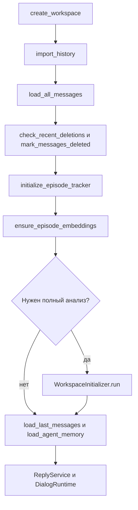

# Порядок выполнения: от запуска до ответа

[К началу путеводителя](STUDY_GUIDE_RU.md) · [К атласу файлов](code_atlas_ru.md)

Это маршруты фактического кода, а не один общий алгоритм, выполняемый целиком
на каждом событии. Имена ниже можно искать в редакторе через поиск по проекту.
Обозначение `объект.метод()` означает вызов функции, принадлежащей этому объекту.

## 1. До main(): Python загружает модули

Начальная команда:

```bash
venv/bin/python live_agent.py
```

`venv/bin/python` — интерпретатор с зависимостями проекта. `live_agent.py` — файл,
который он исполняет. Рабочая папка важна: текущие пути `data` и имя session
относительные. Запускать следует из корня MyBot.

Сначала Python обрабатывает `import` в [live_agent.py](../live_agent.py).
Импортируемые модули тоже могут импортировать другие модули. Их верхнеуровневый
код выполняется при первом импорте в данном процессе.

В частности:

- `config.py` вызывает `load_dotenv()` и читает настройки окружения;
- `telegram/client.py` создаёт объект `TelegramClient`;
- AI-модули создают клиентские объекты для запросов;
- определения `class` и `def` становятся доступными для дальнейших вызовов.

Создать клиентский объект — ещё не отправить запрос модели. Однако ошибка
конфигурации может возникнуть уже во время импорта, до входа в `main()`.
Например, `int(os.getenv("API_ID"))` не сможет преобразовать отсутствующее значение.

Затем выполняется:

```python
if __name__ == "__main__":
    try:
        asyncio.run(main())
    except KeyboardInterrupt:
        pass
```

У непосредственно запущенного файла `__name__` равно `"__main__"`. При обычном
импорте это имя модуля, поэтому такой блок не запускается. `asyncio.run()`
создаёт цикл событий и исполняет корутину `main()` до её завершения.

## 2. main(): создать программу и оставить её ждать

Открой [live_agent.py](../live_agent.py), функцию `main`.

| Порядок | Строка/действие | Зачем |
|---|---|---|
| 1 | `await client.connect()` | Подключить Telethon-клиент аккаунта |
| 2 | `await client.is_user_authorized()` | Проверить уже сохранённую авторизацию |
| 3 | `await client.get_me()` | Получить объект владельца, в частности `me.id` |
| 4 | `SessionState()` | Создать сессионное состояние с пустым настроением |
| 5 | `BotInterface(me.id, [], None, ...)` | Создать интерфейс без активного диалога и сервиса ответов |
| 6 | `RuntimeController(client, me, bot)` | Создать координатор подготовки и переключения |
| 7 | `bot.runtime_controller = controller` | Дать интерфейсу ссылку на координатор |
| 8 | `await bot.start()` | Запустить управляющего бота |
| 9 | `await client.run_until_disconnected()` | Оставить приложение работающим и ждать |

Здесь нет выбора чата через `input()`. Если аккаунт ещё не авторизован,
программа сообщает об этом: первоначальная авторизация не реализована через бота.

`BotInterface.__init__()` не запускает всю подготовку. Он сохраняет ссылки и
создаёт помощников `AgentManager`, `BotCallbacks`, `BotMenu`, `BotPanel`.

На момент создания:

```text
bot.workspace = None
bot.reply_service = None
bot.recent_messages = []
controller.runtime = None
controller.listener = None
controller.busy = False
```

`None` здесь означает «пока отсутствует», а не «пустая папка диалога».

Контроллер также читает `global/preparation_job.json`, если тот существует.
Оставшийся после остановки статус `running` трактуется в памяти как `paused`.
Задача не запускает платную работу автоматически: продолжение выбирается в боте.

## 3. BotInterface.start(): регистрация и запуск пульта

Цепочка в [bot_interface.py](../mybot/telegram/bot_interface.py):

```text
start()
  → build_application()
      → Application.builder().token(...).build()
      → регистрация CommandHandler
      → регистрация CallbackQueryHandler
      → регистрация MessageHandler
  → application.initialize()
  → запомнить ID управляющего бота
  → menu.clean_previous_menus()
  → panel.install()
      → set_my_commands()
      → set_chat_menu_button()
      → panel.show()
  → updater.start_polling()
  → application.start()
  → menu.show(...)
```

`polling` означает, что библиотека получает обновления от Telegram Bot API.
Telethon отдельно получает события твоего аккаунта. Это два разных подключения.

`CommandHandler("reply", self.reply_command)` сопоставляет команду и функцию.
`MessageHandler(filters.TEXT & ~filters.COMMAND, self.text_instruction)` принимает
текстовые сообщения, которые не являются командами.

Очистка меню просматривает максимум 200 последних сообщений чата с ботом.
Удаляются распознаваемые служебные сообщения самого бота. Это не очистка
рабочей переписки собеседника и не удаление файлов истории. Telegram может
отказать в удалении старого сообщения.

## 4. Три входа в одно действие

Возьмём действие «Диалоги».

```text
Вариант A: команда /dialogs
  Telegram Bot API
  → CommandHandler
  → BotInterface.dialogs_command()
  → BotCallbacks.show_dialogs()

Вариант B: inline-кнопка под сообщением
  Telegram Bot API
  → CallbackQueryHandler
  → BotCallbacks.handle()
  → query.answer()
  → dispatch("ui:dialogs:0", ...)
  → show_dialogs()

Вариант C: постоянная кнопка возле клавиатуры
  Telegram присылает обычный текст «💬 Диалоги»
  → MessageHandler
  → BotInterface.text_instruction()
  → поиск текста в PANEL_ACTIONS
  → menu.move_to_bottom()
  → dispatch("ui:dialogs:0", ...)
  → show_dialogs()
  → удаление служебного сообщения-нажатия
```

`query.answer()` сообщает Telegram, что callback принят. Само по себе оно
не выполняет действие и не создаёт ответ AI.

Проверка `is_owner()` требует совпадения ID пользователя, ID чата владельца
и типа чата `private`. Проверка применяется и к callback, и к обычным действиям.

Текст, совпавший с названием кнопки пульта, не становится инструкцией для модели.
Это важная причина порядка веток в `text_instruction()`.

## 5. Показ списка и предварительный выбор

`show_dialogs()` получает список через:

```text
AgentManager.get_dialogs()
  → telegram/dialogs.get_dialogs(client)
  → client.iter_dialogs()
```

Управляющий бот исключается из доступного списка. Список сохраняется в
`context.user_data["ui_dialogs"]`. На переходе к следующей странице используется
эта копия; при открытии страницы 0 список обновляется.

`dialogs_menu()` не ходит в Telegram. Он берёт список объектов и строит кнопки.
По 8 диалогов на страницу. Пример вымышленного callback:

```text
ui:select:123456:2
│  │      │      └─ страница 2, отсчёт с нуля
│  │      └──────── стабильный ID диалога
│  └─────────────── действие
└────────────────── префикс интерфейса
```

После нажатия:

```text
dispatch()
  → select_dialog()
  → RuntimeController.describe(dialog_id)
      → AgentManager.select_dialog()
          → find_dialog()
      → проверка: это не управляющий бот
      → проверка существования файла истории
      → client.get_messages(dialog_id, limit=0)
      → текст о размере истории и обработке
  → context.user_data["pending_dialog"] = dialog_id
  → меню подтверждения
```

Это **ещё не активация**. `AgentManager.selected_dialog` и активный workspace
могут в этот момент относиться к разным чатам. Такой предварительный выбор
не должен менять данные для генерации.

## 6. Подтверждение и фоновая подготовка

Кнопка подтверждения имеет действие `ui:activate:<ID>`.

```text
BotCallbacks.dispatch()
  → проверить pending_dialog
  → удалить использованное подтверждение
  → RuntimeController.activate(dialog_id, progress)
      → проверить busy и lock
      → busy = True
      → сохранить preparation_job.json
      → asyncio.create_task(_activate(...))
      → вернуть управление обработчику кнопки
```

`progress` — переданная функция для отображения статуса. Контроллер не обязан
знать детали Telegram-клавиатуры. Он вызывает `await progress("История...")`,
а интерфейс решает, как показать текст.

`create_task()` — важная развилка. Подготовка продолжает выполняться после того,
как обработчик кнопки завершился. Поэтому можно открыть прогресс или попросить паузу.

Внутри `_activate()`:

1. Получить `controller.lock`.
2. Снова найти диалог по ID: не полагаться только на старое сообщение меню.
3. Отключить старый `LiveEvents`, дождаться уже выполняющегося обработчика.
4. Вызвать `prepare_dialog_runtime()`.
5. Создать новый `LiveEvents` с путями и объектами нового runtime.
6. Зарегистрировать его.
7. Под его блокировкой догрузить сообщения, пришедшие во время подготовки.
8. Присвоить новый runtime, listener, workspace, recent_messages и reply_service.
9. Показать готовность, снять `busy`.

При ошибке активный runtime очищается. Код не обещает продолжить работу с прежним
чатом автоматически: после ошибки следует успешно открыть нужный диалог снова.

## 7. prepare_dialog_runtime(): собрать комплект одного диалога

Файл [dialog_runtime.py](../mybot/services/dialog_runtime.py).



`create_workspace(account_id, dialog_id, name)` строит пути, создаёт каталоги
и записывает manifest. `Workspace` имеет свойства вроде `chat_history`,
`episodes`, `memory_embeddings`. Они возвращают `Path`, а не содержимое файлов.

Условие полного анализа:

```python
needs_analysis = (
    not is_prepared(workspace)
    and (bool(initial_state) or not has_legacy_memory(workspace))
)
if full_analysis or needs_analysis:
    await WorkspaceInitializer(workspace, report).run()
```

Разбор:

- `full_analysis=True` — пользователь явно запросил анализ;
- новый диалог без старой памяти — нужна подготовка;
- незавершённый checkpoint — нужна попытка продолжить;
- `status == "ready"` — автоматически полный анализ не повторяется;
- старый workspace с файлами базовой памяти и её индекса загружается без
  автоматического полного повторного анализа.

Последняя проверка старого workspace основана на наличии файлов. Она не является
полным аудитом качества или актуальности данных.

## 8. Импорт: почему 200 сообщений и один файл

Файл [history_import.py](../mybot/services/history_import.py).

```text
get_last_saved_message_id(workspace.chat_history)
  → client.iter_messages(min_id=last_id, reverse=True, limit=None)
  → exporter.message_to_data() для каждого сообщения
  → накопить до 200 записей
  → durable_call(commit_batch, ...)
  → повторить
  → сохранить оставшуюся неполную порцию
```

`message_to_data()` превращает объект Telethon в обычный словарь: ID, дата,
автор, тип, текст, метаданные файла, информация о цитируемом сообщении.
Собственный отправитель обозначается строкой `"Я"`.

`commit_batch()` сохраняет историю в совместимом старом формате: один JSON-объект
может занимать много строк, записи разделены пустой строкой. Название `.jsonl`
не делает этот файл строгим JSONL. Не заменяй его чтение на `json.loads(line)`.

Для импорта целиком сохраняется новая версия файла через временный файл и
`os.replace`. При остановке между порциями уже сохранённые 200 записей остаются.
Следующий запуск получает последний сохранённый ID и продолжает после него.

Это компромисс: такой импорт избегает полузаписанной порции, но при каждой
фиксации перечитывает/переписывает предыдущую историю. Для очень больших объёмов
это дороже по дисковым операциям, чем полноценная база данных или журнал.

## 9. Эпизоды: конкретный пример

Файл [episodes/incremental.py](../mybot/episodes/incremental.py).

Возьмём вымышленные сообщения:

```text
1. Другой: Как прошёл день?
2. Другой: Удалось отдохнуть?
3. Я: Да, сегодня спокойно.
4. Я: Немного погулял.
5. Другой: Здорово!
```

`IncrementalEpisodeTracker.process_message()` поддерживает:

- `incoming` — блок входящих;
- `response` — последующий блок своих ответов;
- `previous_context` — контекст перед началом ситуации;
- `recent_context` — короткую очередь последних сообщений;
- `next_episode_id` — номер следующего эпизода.

После сообщения 4 блок ответа ещё может продолжиться. При сообщении 5
трекер завершает эпизод «1, 2 → 3, 4» и начинает новый входящий блок.
Поэтому последний незавершённый блок не обязательно сразу находится в `episodes.jsonl`.
Само сообщение уже сохранено в истории.

`initialize_episode_tracker()` восстанавливает трекер по истории и последнему
сохранённому эпизоду. Если ненулевой последний обработанный ID отсутствует,
`find_history_start()` выбрасывает ошибку. Код не должен считать это разрешением
построить всё с нуля.

Новые эпизоды индексируются порциями по 32. Для embedding используется входящая
часть эпизода; текущая реализация ограничивает текст одного такого запроса
первыми 12 000 символами. Это влияет на поиск длинных эпизодов, но не удаляет
полный текст эпизода из файла.

`ensure_episode_embeddings()` отдельно ищет эпизоды без имеющегося индекса и
достраивает недостающие embeddings, сохраняя исходные ID.

## 10. Почему эпизоды публикуются через журнал

Связаны два файла:

```text
episodes.jsonl                 # текст и структура эпизода
episode_embeddings_live.jsonl  # вектор того же episode_id
```

Если записать первый, а перед вторым потерять процесс, получится частичная запись
с точки зрения системы. В [checkpoint.py](../mybot/episodes/checkpoint.py):

```text
commit_batch()
  → закончить предыдущую pending-порцию, если есть
  → атомарно записать episode_pending_batch.json
  → recover_batch()
      → добавить отсутствующие embeddings
      → добавить отсутствующие episodes
      → записать null в pending-файл
```

Повторное применение порции не должно создавать второй экземпляр того же ID.
Это называется **идемпотентностью**. Журнал помогает восстановить эти два файла,
но не превращает все файлы приложения в одну общую транзакционную базу.

## 11. Полный анализ: WorkspaceInitializer

Файл [workspace_initializer.py](../mybot/services/workspace_initializer.py).

`run()` — оболочка, которая записывает `failed` или `paused`, если `_run()`
завершился исключением. Основная работа — в `_run()`:

| Этап | Вызовы | Что сохраняется |
|---|---|---|
| Прочитать снимок истории | `load_all_messages`, исключая известные удаления | Рабочий список в RAM |
| Разделить историю | `bounded_chunks` | Части в RAM |
| Проанализировать части | `analyze_full_history` через `cached` | JSON-анализы в `chunk_analysis/pipeline_v1/analysis/` |
| Собрать текст анализов | `write_text` | `full_history_analysis.txt` |
| Объединить наблюдения | `merge_memory_category` по ограниченным группам | Кэш объединений |
| Индексировать память | `create_memory_embeddings` по 32 записи | Кэш embeddings |
| Опубликовать память | `write_json` | `agent_memory.json`, `memory_embeddings.json` |
| Создать недостающие локальные профили | `write_json`, только если файлов нет | `user_profile.json`, `person_profile.json` |
| Запомнить границу обработки | `write_json` | `memory_update_state.json` |
| Выделить общий стиль | `build_style`, `publish_style` | Файлы в `global/` |
| Отметить результат | запись состояния | `initialization_state.json: ready` |

Части ограничены 100 элементами и примерно 24 000 символами сериализованных
данных. Длинный текст одного сообщения делится на фрагменты до 8 000 символов.
Количество частей поэтому может быть больше, чем `число сообщений / 100`.

Шесть категорий извлечения:

```text
style_patterns       особенности стиля в этом диалоге
behavior_patterns    характерные реакции
user_facts           факты о пользователе, замеченные здесь
person_facts         факты о собеседнике
relationship_facts   факты об отношениях
important_events     значимые события
```

Объединение идёт ограниченными группами. Между группами удаляются точные
дубликаты текста. Это не полноценное семантическое объединение всей истории
одним запросом: сходные формулировки из разных групп ещё могут остаться.

`cached()` вычисляет SHA-256 от типа операции, моделей и входных данных.
Если соответствующий JSON уже существует и проходит проверку, AI не вызывается.
Новый или изменившийся вход получает другой ключ. Это не «магическая память AI»:
результат хранится на твоём диске и снова читается программой.

## 12. Общий стиль: что переносится между чатами

`build_style()` выбирает только записи `sender == "Я"` с текстом. В отдельный
AI-запрос идут собственные сообщения без блоков собеседника и без локальных профилей.

Модель должна вернуть ровно пять ключей из `TRAITS`. `validate_traits()` проверяет
и имена ключей, и допустимые значения:

```json
{
  "length": "short",
  "formality": "informal",
  "emoji": "moderate",
  "punctuation": "minimal",
  "message_splitting": "multiple"
}
```

Это искусственный учебный пример, не прочитанный профиль владельца.

`publish_style()` считает, сколько частей анализа выбрало каждое значение.
Вклад диалога заменяется при повторной обработке, а не прибавляется ещё раз.
Для аккаунта выбирается наиболее частое значение по каждой характеристике.
Более длинные чаты с большим количеством частей могут иметь больший вес.
Счётчик сообщений — метаданные, не отдельная модель равного взвешивания диалогов.

В общей папке не публикуются произвольные тексты AI с фактами или цитатами.
`load_global_style()` снова пропускает только разрешённые значения перед вставкой
в запрос. Общий профиль пока грубый: он не хранит любимые конкретные слова,
грамматические привычки или контекстные исключения.

## 13. Живое сообщение после активации

```text
Telegram-аккаунт
  → Telethon events.NewMessage(chats=активный_ID)
  → LiveEvents.on_new_message(event)
      → получить message_processing_lock
      → проверить enabled
      → message_to_data()
      → проверить known_message_ids
      → append_message_data(workspace.chat_history)
      → recent_messages.append(...)
      → оставить последние 15 сообщений
      → если автор не «Я»: send_incoming_message()
      → process_live_episode_message()
          → tracker.process_message()
          → если завершён эпизод: embedding + commit_batch()
```

Таким образом, новое сообщение не вызывает автоматически генерацию ответа или
полный анализ долговременной памяти. Иногда оно завершает эпизод и вызывает
embedding-запрос для этого эпизода.

`recent_messages` — общий объект списка. На него ссылаются runtime, интерфейс,
сервис ответов и обработчик событий. Изменение списка видно всем этим объектам.

`LiveEvents.unregister()` сначала устанавливает `enabled = False`, удаляет
подписки и ждёт освобождения блокировки. Проверка флага внутри обработчика
нужна для событий, которые уже оказались в очереди к моменту отключения.

## 14. Удаление сообщения

`events.MessageDeleted()` регистрируется отдельно. В обработчике:

1. Взять удалённые ID из события.
2. Пересечь их с ID, известными текущему runtime.
3. Проверить наличие сообщений именно в выбранном диалоге через Telegram.
4. Записать подтверждённые удаления в файл этого workspace.
5. Удалить их из текущего контекста и незавершённого трекера.

При поиске эпизодов исключаются эпизоды с удалёнными ID и пересечения с текущим
контекстом. Это не означает удаления всех старых AI-выводов из памяти: отдельного
полного механизма отзыва производных фактов пока нет.

## 15. Генерация ответа: самая полезная цепочка для изучения

```text
Кнопка «Ответ» / команда /reply / обычная инструкция
  → BotInterface.send_generated_answers()
  → @active_operation
      → проверить владельца, активный workspace и отсутствие подготовки
      → получить controller.lock
  → ReplyService.generate(instruction, current_mood)
      → выбрать инструкцию по умолчанию, если своей нет
      → apply_mood()
      → list(recent_messages): снимок состава списка
      → generation_lock
      → build_ai_request()
          → load_global_style(account_id)
          → format_memory(local user_profile, person_profile)
          → find_relevant_memories()
          → если есть последние входящие: find_similar_episodes()
          → собрать текст
      → записать workspace.ai_request_preview
      → ai/client.generate_answers(ai_request)
  → split_variants()
  → send_long_text() для каждого результата
  → показать сообщения тебе в управляющем боте
```

Декоратор `@active_operation` — обёртка вокруг функции, а не комментарий.
Его проверка и блокировка выполняются до тела `send_generated_answers`.

`list(recent_messages)` создаёт отдельный список, но не глубокую копию каждого
словаря сообщения. В данном сценарии это фиксирует набор сообщений для запроса.

Поиск памяти:

```text
последние сообщения → текст поискового запроса → embedding запроса
→ сравнить с base/live embeddings памяти → cosine_similarity
→ порог сходства → сортировка → точная дедупликация → лучшие записи
```

Поиск эпизодов похож, но результат содержит реальные входящие и реальные ответы
пользователя. Embeddings не отправляются в итоговый текст вместо воспоминаний:
они помогают выбрать записи, после чего в prompt попадает их читаемый текст.

Если соответствующих индексов нет, функции поиска возвращают пустой результат
без embedding-запроса к пустой базе. Обычная генерация может включать не только
один запрос за ответом, но и запросы embeddings для поиска.

`generate_answers()` задаёт отдельные `instructions`, модель, лимит ответа и
`input=ai_request`. Поэтому файл preview полезен, но ещё не является полным
сериализованным API-запросом.

Модель просят вернуть три варианта. `split_variants()` ищет номера `1`, `2`, `3`.
Если разбор не дал ровно три варианта, код возвращает весь текст одним элементом.
Это объясняет возможное сообщение с одним результатом при нарушенном формате AI.

## 16. Настроение и обычный текст

Порядок веток в `text_instruction()`:

```text
текст совпал с кнопкой пульта? → выполнить действие пульта
иначе awaiting_mood установлен? → сохранить настроение, не вызывать AI
иначе → использовать текст как инструкцию для генерации
```

Кнопка «Задать настроение» устанавливает `context.user_data["awaiting_mood"]`.
Следующее подходящее текстовое сообщение переносится в `SessionState.current_mood`.
Дальше `ReplyService.apply_mood()` добавляет к инструкции объяснение временного
состояния. Отдельного сохранения этого состояния в общий профиль нет.

## 17. Пауза, продолжение, остановка

`RuntimeController.pause()` отменяет task подготовки через `task.cancel()` и
дожидается её завершения. Отмена доставляется как `asyncio.CancelledError`.
Обработчики сохраняют состояние `paused`, снимают активный runtime и оставляют
готовые файлы для продолжения.

Дисковая фиксация через `durable_call()` вынесена в рабочий поток. Отмена не должна
позволять новой задаче начать запись поверх ещё работающего потока: `shield`
защищает ожидание фиксации, а обработчик отмены дожидается потока и затем
передаёт отмену дальше.

`resume()` читает ID и флаг полного анализа из последней задачи и снова вызывает
`activate()`. Это **повторный запуск алгоритма с использованием checkpoint**,
а не восстановление Python точно на прежней строке.

При выходе из `main()` выполняются `finally`:

```text
controller.stop()
  → pause() текущей подготовки
  → unregister() активного listener, если он есть
bot.stop()
  → остановить polling
  → остановить Application
  → shutdown()
client.disconnect()
```

`finally` помогает закрывать ресурсы и при ошибке. Оно не даёт гарантии при
аварийном завершении операционной системы или принудительном уничтожении процесса.

## 18. Где поставить стрелки на бумажной схеме

Разными линиями обозначай:

- сплошная стрелка: «вызвал и ждёт результат»;
- пунктир: «зарегистрировал обработчик, вызов придёт позже»;
- двойная стрелка: «запустил фоновую задачу»;
- стрелка к цилиндру/конверту: «читает или пишет файл»;
- значок монеты: «здесь возможен AI API-запрос»;
- значок замка: «здесь используется lock или проверка владельца».

Не проводи одну стрелку «main → generate_answers» без промежуточных событий:
она скрывает самое важное устройство приложения.
